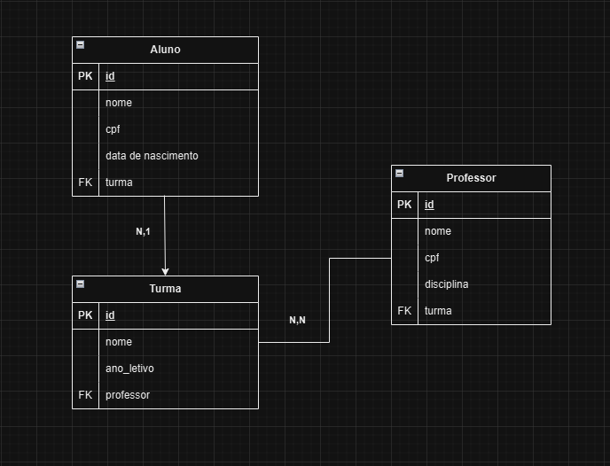

# 📚 Gerenciador Escolar
Este é um sistema web para o gerenciamento de alunos de uma escola, permitindo o cadastro, consulta, atualização e remoção de alunos, além da associação com turmas.

O sistema visa facilitar a administração escolar, permitindo que os responsáveis possam gerenciar o cadastro de alunos e suas respectivas turmas de forma eficiente e organizada.

🛠 Tecnologias Utilizadas
---

**🔹 Backend:**

Java – Linguagem principal.

Spring Boot – Framework robusto e produtivo para desenvolvimento rápido de APIs.

MySQL - Banco de dados relacional, ideal para estruturar os dados de alunos e turmas.

**🔹 Frontend:**

TypeScript - Linguagem principal.

React (Vite) – Oferece uma interface dinâmica e moderna com melhor manutenção e escalabilidade.

💡 Estratégias de Desenvolvimento
---

• **Divisão em Módulos:** Separação do backend e frontend para facilitar a manutenção e escalabilidade.

• **Uso de API REST:** Comunicação entre frontend e backend de forma padronizada.

• **Banco de Dados Relacional:** Utilização de um banco relacional para garantir integridade dos dados.

• **Testes básicos:** Verificação das principais funcionalidades para garantir funcionamento adequado.

📌 Requisitos Funcionais (RF)
---

**RF01** – O sistema deve permitir o cadastro de alunos com nome, CPF, email e data de nascimento.

**RF02** – O sistema deve permitir a listagem, edição e remoção de alunos.

**RF03** – O sistema deve permitir o cadastro de turmas com nome e ano letivo.

**RF04** – O sistema deve permitir a listagem, edição e remoção de turmas.

**RF05** - O sistema deve permitir o cadastro de professores com nome, CPF, email e disciplina.

**RF06** - O sistema deve permitir a listagem, edição e remoção de professores.

**RF07** – O sistema deve permitir associar alunos e professores a turmas e visualizar essa associação.

**RF08** – O sistema deve permitir consultar alunos, turmas e professores.


📌 Requisitos Não Funcionais (RNF)
---
**RNF01** – O backend deve ser desenvolvido em Java (Spring Boot).

**RNF02** – O frontend deve ser desenvolvido com React + TypeScript.

**RNF03** – O sistema deve utilizar um banco de dados relacional.

**RNF04** – O sistema deve utilizar REST API para comunicação entre frontend e backend.

**RNF05** – O sistema deve ser responsivo para acesso em diferentes dispositivos.

**RNF06** – O carregamento das consultas deve ser inferior a 5 segundos.

⚙ Arquitetura Monolítica
---

• É mais simples de desenvolver e manter, ideal para projetos acadêmicos.

• Permite uma implementação mais rápida, sem a complexidade da comunicação entre microservices.

• Facilita a integração entre as partes do sistema sem necessidade de configurar múltiplos serviços independentes.

📅 Plano de Trabalho
---

• Configuração do projeto.

• Desenvolvimento do back-end.

• Desenvolvimento do front-end.

• Integração entre o back e o front.

• Testes e ajutes.

• Finalização e Documentação.

Modelo Entidade Relacionamento
---



Figma
---
https://www.figma.com/design/pVo70EptD7JtCAop8NtXLE/projetoweb?node-id=0-1&t=du2nefrqrvr9jsmJ-1

🚀 Inicialização do Projeto
---

### 1. **Pré-requisitos**

Antes de iniciar, você precisa garantir que as seguintes ferramentas estão instaladas no seu sistema:

- **Java 11 ou superior**;
- **Maven**;
- **Node.js**;
- **MySQL**;

### 2. **Configuração do Backend (Spring Boot)**

#### 📁 Clonar o repositório

```bash
git clone https://github.com/danisantosss/projetoweb
cd projetoweb
```

#### ⚙️ Configurar o banco de dados MySQL

1. Crie um banco de dados no MySQL, `gerenciador_escolar`.
2. Configure as credenciais no arquivo `src/main/resources/application.properties`:

```properties
spring.datasource.url=jdbc:mysql://localhost:3306/gerenciador_escolar
spring.datasource.username=root
spring.datasource.password=sua_senha
spring.datasource.driver-class-name=com.mysql.cj.jdbc.Driver
spring.jpa.hibernate.ddl-auto=update
```

#### ▶️ Rodar o backend

```bash
mvn spring-boot:run
```

O backend estará disponível em: `http://localhost:8080`
